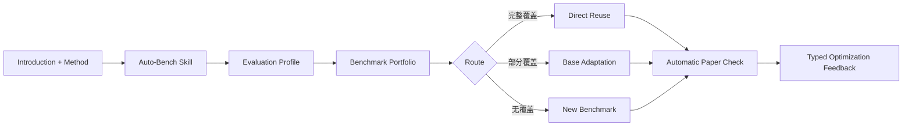

# Auto-Bench Skill

这是一个 **Codex Skill**，不是需要部署的独立系统或服务。

Auto-Bench 根据论文的 **Introduction + Method** 或用户提出的新 Method，自动完成：

1. 提取任务、模态、交互、输出、环境和能力需求；
2. 推荐覆盖不同评测构造的 benchmark portfolio，而不是只给一个 benchmark；
3. 设计指标、baseline 和执行要求；
4. 判断应该直接复用、基于基础 benchmark 改造，还是新建 benchmark；
5. 对已有论文，在盲匹配完成后自动核对论文采用的 benchmark；
6. 输出 Match、Partial、Mismatch 和下一轮优化信号，不要求用户填写人工评测文件。

## Skill 位置

仓库源文件：

```text
skills/auto-bench/
├── SKILL.md
├── agents/openai.yaml
├── assets/benchmark_catalog.json
├── references/
│   ├── input-schema.md
│   ├── output-contract.md
│   └── paper-evidence-schema.md
└── scripts/
    ├── run_auto_bench.py
    ├── review_plan.py
    └── autobench/
```

本机安装位置：

```text
${CODEX_HOME:-$HOME/.codex}/skills/auto-bench
```

## 触发方式

可以直接说：

- `用 $auto-bench 根据这篇论文的 Introduction 和 Method 推荐 benchmark。`
- `用 $auto-bench 给我的新 Method 设计 benchmark、指标和 baseline。`
- `用 $auto-bench 核对你推荐的 benchmark 与论文实际使用的是否一致。`
- `这项创新没有现成 benchmark，帮我设计 base adaptation 或新 benchmark。`

Skill 也支持隐式触发，例如“根据论文 Method 找 benchmark”“自动设计评测集”“给研究创新设计 benchmark”。

## Skill 工作流



对已有论文，Skill 先只使用 Introduction/Method 生成并保存 plan，再读取 Experiment/Evaluation 中的 benchmark 证据进行自动核对。对用户的新 Method，没有来源论文 gold 时，自动核对状态为 `NOT_APPLICABLE`，但仍输出完整 benchmark 设计方案。

## 可移植脚本

### 生成 benchmark 计划

```bash
SKILL_ROOT="${CODEX_HOME:-$HOME/.codex}/skills/auto-bench"
python3 "$SKILL_ROOT/scripts/run_auto_bench.py" match \
  --input /PATH/method_input.json \
  --output /PATH/auto_bench_plan
```

### 执行 adaptation 或 synthesis

```bash
python3 "$SKILL_ROOT/scripts/run_auto_bench.py" run \
  --input /PATH/method_input.json \
  --output /PATH/auto_bench_run \
  --base-records /PATH/train_or_development_records.jsonl \
  --source-benchmark BASE_BENCHMARK \
  --source-split train \
  --transformation interaction_wrapper
```

### 自动与论文核对

```bash
python3 "$SKILL_ROOT/scripts/review_plan.py" \
  --plan /PATH/auto_bench_plan/benchmark_plan.json \
  --paper-evidence /PATH/paper_evidence.json \
  --output-json /PATH/automatic_literature_review.json \
  --output-markdown /PATH/automatic_literature_review.md \
  --evidence-class fresh_holdout
```

输入与证据 schema 位于 Skill 的 `references/`。

## 安装

```bash
mkdir -p "${CODEX_HOME:-$HOME/.codex}/skills"
cp -R skills/auto-bench "${CODEX_HOME:-$HOME/.codex}/skills/auto-bench"
```

安装后重开一个 Codex task，即可通过 `$auto-bench` 调用。

## 验证

```bash
python3 "$HOME/.codex/skills/.system/skill-creator/scripts/quick_validate.py" skills/auto-bench
python3 skills/auto-bench/scripts/run_auto_bench.py --help
python3 skills/auto-bench/scripts/review_plan.py --help
```

当前验证结果：

- 官方 Skill validator：通过；
- 路径隐私检查：通过；
- 仓库源与安装副本：一致；
- 临时目录独立运行：通过；
- `match`、`run`、三种 synthesis verification、自动论文核对：通过；
- Skill 文件数：21；
- benchmark catalog：26 条记录；
- 用户人工评测：不需要。

## 仓库其他目录

根目录的 `autobench/`、`assets/` 和旧 `step*.py` 是开发 Auto-Bench Skill 时使用的实验原型、盲测集和回归证据。真正需要安装和发布的产品是 `skills/auto-bench/`。
