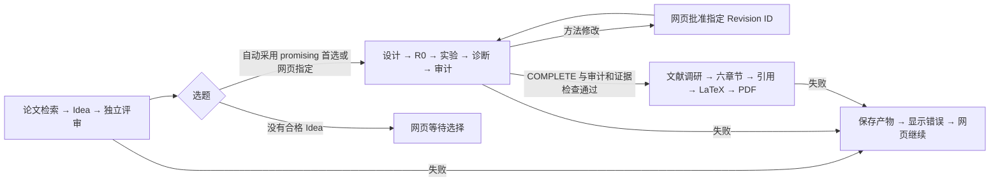

# 前端全流程与恢复设计

## 日常入口

在仓库根目录首次启动 `.venv/bin/python3 -m workbench --port 8760`，随后使用 <http://127.0.0.1:8760/>。网页入口与研究工作进程分开，后台退出时仍能在首页点击“启动 / 重启服务”。初次安装、机器开机后工作台尚未运行、账号需要重新登录或机器资源不可用，仍需先解决相应外部条件；网页不能在所有本地进程都不存在时自行启动操作系统进程。

首页“新建全流程”可从研究方向开始，也可接续已有 Search、Design 或 Writing 任务。点击启动意味着授权当前全流程的正常推进，原有科学锁和审批要求保持有效。单独打开模块仍可独立操作，不会自行创建流程。

## 状态与衔接

- **Search → Design**：复用 Search 的 `evaluation.json` 排序，不新增评分模型。自动模式只取 `promising`、未被人工废弃、不是 PASS/放弃文档的第一个 Idea。手动模式在候选卡片等待选择。传入选定 `papers/<id>/idea.md` 的完整内容，保存 `search_handoff.json` 的来源路径、任务编号、Idea 编号和评审内容。
- **Design → Writing**：要求任务完成、磁盘阶段确为 `COMPLETE`、原审计/结果检查通过且没有未关闭的实验动作。沿用 `validate_handoff` 与原始证据校验，不以 UI 标签代替科学完成状态。写作输入包含交接说明、实验方案、诊断、审计、均值与逐 seed 结果、结果契约和执行记录。超过单文件 20 MB 的证据保留完整来源路径供读取，不裁剪数据。
- **Writing**：顺序为 Introduction 调研、Introduction、Related Work 规划、Related Work 调研、Related Work、Method、Experiments、Conclusion、Abstract、参考文献插入、排版与编译。依赖检查复用原函数。失败时停止；显式继续只重新执行首个尚未完成步骤。模板可预先上传或后来替换，未上传使用通用 article 模板；不会自动认定满足某个会议格式。

流程关联保存在 `assets/output/workbench/pipelines/flow-<id>.json`；三个模块继续维护原任务和产物。流程记录只保存关联、当前位置、交接记录和控制意图。创建的模块任务写入同一 `pipeline_id`，恢复交接时先查找已有任务，避免在“创建模块任务后、保存流程关联前”中断造成重复创建。

## 失败、停止与继续

| 情况 | 网页操作 | 实际行为 |
| --- | --- | --- |
| Search 调用失败 | 继续 | 在原目录复用已保存的 manifest、已校验 Idea 和评审，不重新搜索已完成资料 |
| Search 调用卡住 | 停止并保留 | 停止当前 Codex 调用，保留已有产物；原取消并删除 API 仅保留供原有调用方使用 |
| Design 正常暂停 | 安全暂停 | 不派发新单元，当前实验单元自然收尾；排队任务无需等待前一任务结束 |
| Design 控制器卡住 | 停止卡住的控制器 | 仅终止本任务的 CLI 控制器，保留训练、checkpoint 和记录；继续时先核对本地/远端在途执行 |
| Design 普通错误 | 填写恢复说明并继续 | 新调用读取错误、日志、恢复说明和原状态，在原科学边界内排查；恢复说明不构成方法或预算批准 |
| Writing 单步失败 | 自动完成 / 继续 | 重新执行当前失败步骤，后续按依赖自动推进，已完成且未失效的章节复用 |
| PDF 编译失败 | 只重试 PDF 编译，或流程继续 | 复用 LaTeX 源码重新编译，不重新生成论文或调用模型排版 |
| 方法修改 | 阅读完整提案后批准或拒绝 | 使用当前 Revision ID 和持久化决定，刷新不丢失批准；拒绝不会由自动流程覆盖 |
| 工作服务退出 | 首页启动 / 重启服务 | 独立入口重新启动工作服务，流程保持暂停，点击继续后恢复原模块任务 |
| CLI / 编译器路径错误 | 服务面板修改路径并重启 | 只保存可执行文件路径，不修改模型、种子、数据、科学预算或全局登录配置 |

点击流程“暂停”会停止后续派发：Search 停止当前调用并保留产物；Design 请求安全暂停；Writing 暂停自动推进并允许当前步骤完成。点击“停止卡住的控制器”还会停止当前 Writing 调用或 Design 控制器。停止实验控制器不意味着远端训练已停止，禁止据此直接重复派发同一实验。

服务重启先暂停流程、停止本服务管理的控制器，确认模块工作已退出后才替换工作进程。45 秒内没有排空则保留服务并显示失败，不强制终止训练。独立网页入口自身退出时需要重新启动工作台。单纯刷新浏览器不会停止运行。

## 实现位置

| 文件 | 职责 |
| --- | --- |
| `workbench/pipeline.py` | 持久化关联、选题、交接、等待审批、暂停与恢复，复用模块管理器 |
| `workbench/supervisor.py` | 常驻网页入口、工作进程启动/重启、服务日志与路径设置 |
| `workbench/server.py` | 模块代理、流程 API、重启前停止控制器与运行状态 |
| `workbench/web/pipelines.js` | 全流程表单、任务卡片、候选与审批、错误与恢复、服务面板 |
| `auto_search/web/serve.py` | 保留产物停止、同目录恢复、重启后状态识别 |
| `auto_design/codex_runner.py` | 可中断静默 CLI 的事件读取，保留实际执行日志 |
| `auto_design/orchestration.py` | 排队暂停、控制器停止、恢复说明及科学审批 |
| `auto_writing/web/automation.py` | 原写作步骤的依赖顺序与默认模板 |
| `auto_writing/web/serve.py` | 自动写作、单步重试、独立编译、运行日志 |

## 接口

- `GET/POST /api/pipelines`：查看或创建全流程；创建参数有 `direction`、`paper_count`、`selection`、`start_stage`、`source_id`、可选 `template_file`。
- `GET /api/pipelines/<id>`：流程与可选 Idea。
- `POST /api/pipelines/<id>/pause|interrupt|resume|select|template`：控制流程；`resume` 可附带 `recovery_note`，`select` 使用 `idea_id`。
- `GET /api/service`、`GET /api/service/log`、`POST /api/service/restart`：独立入口的恢复接口；重启可附带 `settings.CODEX_CLI`、`settings.LATEX_COMPILER`。
- `POST /auto-search/api/runs/<run>/resume`、`POST /auto-search/api/jobs/<id>/stop`：Search 保留产物恢复与停止。
- `POST /auto-design/api/tasks/<id>/interrupt`：停止本任务控制器；原 start/resume 接收 `recovery_note`。
- `POST /auto-writing/api/writings/<id>/auto-start|auto-pause|recompile`：写作自动推进、暂停、单独编译；`GET .../logs` 读取日志。

## 验证范围

测试使用隔离工程输入和明确标注的模型响应，检查真实文件、HTTP、子进程、模块管理器、科学交接门槛与恢复语义。工程 PDF 下载测试不代表论文质量或科研结果。没有运行远端 GPU、正式训练或数据集评估。

网页验收目录为 `assets/logs/workbench/workflow-ui/`，与正常任务索引隔离。网页实际创建工程流程，停在手动选题，选择后自动跨模块运行；人为注入 Method 失败，再从网页继续到 PDF 下载。390px 首页及表单无横向溢出。
